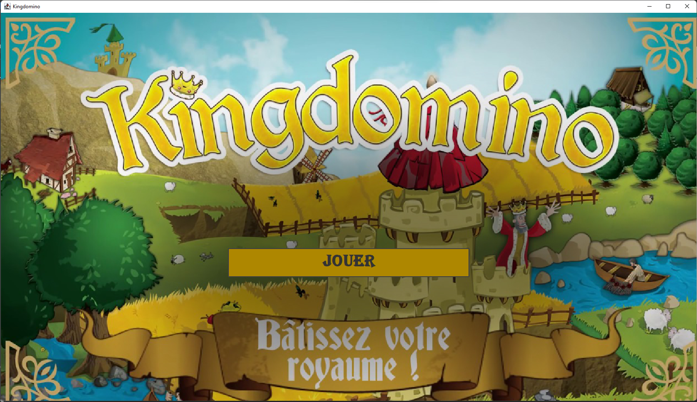
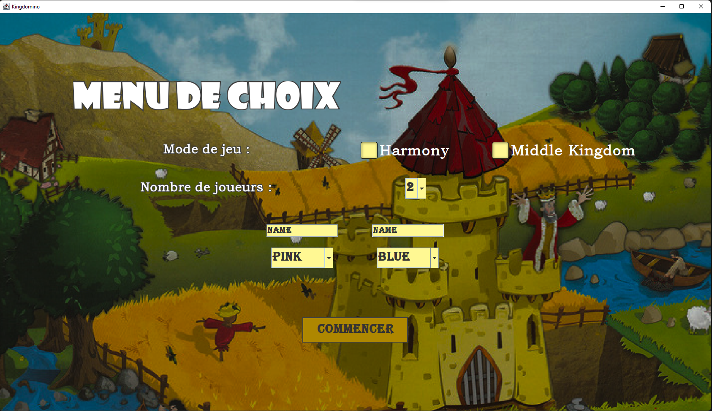
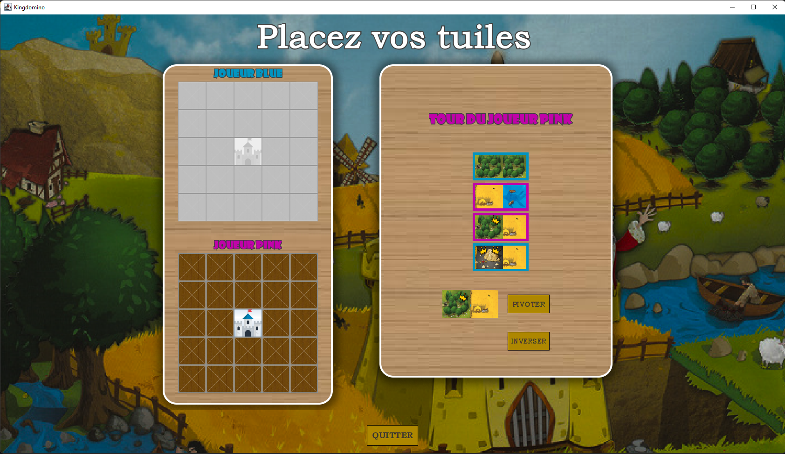
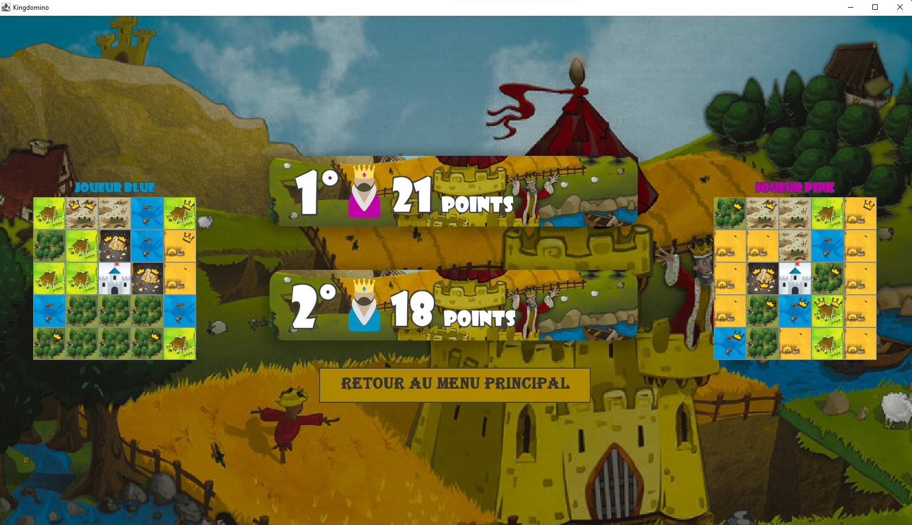

**Mode d'emploi**
==========


_1. Accéder au jeu_
==========

Pour pouvoir jouer au jeu KingDomino, veuillez télécharger notre dépôt git sous format zip.


Après avoit téléchargé et dézippé notre projet, soit :

* vous ouvrez le dossier a31-kingdomino puis vous vous rendez au dossier rendu2, out, artifact puis KingDomino_jar
Dans le dossier KingDomino_jar, vous trouverez un exécutable au nom de KingDomino et vous pouvez l'ouvrir.

* vous ouvrez le dossier a31-kingdomino dans un terminal, puis accéder au dossier KingDomino à l'aide de la commande suivante
```sh
$ cd rendu2/out/artifact/KingDomino_jar
```
Après cela, exécutez la commande ci-dessous pour ouvrir l'exécutable 
```sh
$ java -jar KingDomino.jar 
```
L'exécutable est alors affiché.

_2. Découverte du jeu_
==========
Lorsque vous avez exécuté l'exécutable KingDomino.jar, la fenêtre suivante s'affiche:



Vous cliquez sur le bouton "JOUER" pour commencer une partie et la fenêtre suivante s'affiche comme ci-dessous : 



Vous avez le choix de jouer en mode normal (en ne cochant aucun mode de jeu), de jouer en mode Harmonie, en mode MiddleKingdom ou les deux modes (en cochant dans ce cas les deux modes).
Vous pouvez également choisir le nombre de joueur et les nommer si vous en avez envie.

Après avoir cliqué sur le bouton "COMMENCER", vous commencerez alors la partie : 



Lorsque la partie est terminé, vous arrivez à une page de fin de jeu qui affichera le score de chaque joueur ainsi que leur plateau.
Vous pouvez retourner au menu principal pour rejouer!



Amusez-vous bien 🥰
===========
