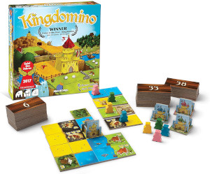

Kingdomino
==========

L'objectif de ce projet est de concevoir une application permettant de jouer au jeu de société Kingdomino.

Les règles
----------

### Résumé

Kingdomino se joue de 2 à 4 joueurs. L'objectif est de construire un royaume composé de Dominos :

- Un domino est composé 2 tuiles qui ont chacune un type de terrain (champs, herbe, forêt, etc.) et pour certaines une à 3 couronnes.
- Un royaume est un domaine carré de 5x5 tuiles dont un château

Chaque joueur ajoute les dominos un par un à son royaume. Un domino doit être posé :

- en connectant au moins l'une de ses tuiles à une tuile du royaume de même type
- en restant dans un carré de 5x5

Si un joueur ne peut pas placer le domino choisi, celui-ci est défaussé.

Le gagnant est celui qui construit le royaume rapportant le plus grand nombre de points de prestige, calculé comme la somme des points de chaque domaine. Le nombre de points d'un domaine correspond au produit de son nombre de tuiles avec son nombre de couronnes.

### Règles complètes

Vous trouverez les règles au format texte dans le [Livret de Règles](rendu1/docs/reglesKingdomino.pdf), et en regardant les vidéos d'explications :

- en version courte avec [LudoChrono](https://www.youtube.com/watch?v=jnM9yf65rpo) ou [Touslesprix.com](https://www.youtube.com/watch?v=MBPFPKehV44) : ~ 5 minutes
- en version plus longue avec [Yahndrev](https://www.youtube.com/watch?v=93VxIXxthFU) : ~ 15 minutes

### Matériel

La liste des dominos est disponible sur [ce dépot Github](https://github.com/RuPaulsDataRace/Kingdomino-For-Queens).

Attendus
--------

Votre application doit proposer ces fonctionnalités :

- Choix du nombre de joueurs (2 à 4)
- Sélection **avant le début de la partie** des règles de calcul optionnelles parmi "Dynastie", "Empire du milieu" et "Harmonie"
- Chaque joueur positionne initialement son château dans son royaume : il ne pourra plus être déplacé
- À son tour un joueur doit pouvoir placer dans son royaume le domino présélectionné **puis** sélectionner le domino suivant
- Votre application graphique doit proposer :
  - une fenêtre de démarrage pour choisir les paramètres : joueurs, mode de calcul des points, etc.
  - une fenêtre de jeu avec les royaumes de chaque joueur et qui permette à chaque joueur de jouer successivement jusqu'à la fin de la partie
  - une fenêtre de fin de jeu qui affiche les scores et annonce le vainqueur

Veillez à avoir une interface ergonomique qui affiche les informations utiles à chaque joueur.

Consignes
---------

### Pour démarrer avec le dépôt Git

- Créez un groupe `nom1-nom2` où nom1 et nom2 sont les noms de famille des deux membres du binôme
- Forkez le dépôt https://git.unistra.fr/a313/a31-kingdomino dans le groupe créé ci-dessus
- Ajoutez le responsable du module et votre enseignant de TP comme Reporter de votre dépôt

### Sur toute la durée 

- Ce projet est à réaliser **en binôme**.
- Vous devez concevoir en UML et implémenter en Java le jeu de société Kingdomino, en respectant une **architecture MVC** et en proposant une **interface graphique en Swing**.
- Vous devez respecter les **principes de conception** et mettre en œuvre les **patrons de conception** vus en cours, **lorsque cela est pertinent**. Attention, il ne s'agit pas d'essayer d'utiliser tous les patrons de conception vus en cours !
- Vous rédigerez parallèlement **un (ou des) rapports** pour expliquer vos choix de conception. Il est possible aussi que vous soyez amenés à renoncer à une partie du développement par manque de temps. Dans ce cas, le rapport est l’endroit où signaler ce problème (il aurait fallu faire *ceci* mais je n’avais pas assez de temps devant moi et j’ai préféré me concentrer sur *cela* parce que ...).
- Votre dépôt devra être **mis à jour au minimum après chaque séance de TP** de façon à ce que nous puissions évaluer votre démarche sur toute la durée du projet.

Rendus
------

### 1er rendu

Date limite : le dimanche **19/12 à 23h59**

Documents :

- diagrammes UML
- code source
- rapport pour expliquer vos choix de conception

Le rendu est à faire sur votre dépôt Git dans un répertoire `rendu1`.

### 2ème rendu

Date limite : le dimanche **9/01 à 23h59**

Documents :

- diagrammes UML
- code source
- un exécutable au format JAR
- un mode d'emploi pour démarrer l'application
- rapport pour présenter vos nouveaux choix de conception depuis le 1er rendu et expliquer les raisons des modifications de choix de conception qui avait été annoncé au 1er rendu.

Le rendu est à faire sur votre dépôt Git dans un répertoire `rendu2`.

### Précisions

- Vos diagrammes UML doivent être au format PlantUML et svg,
- Les rapports et le mode d'emploi doivent être au format Markdown.
- À la fin du projet, votre dépôt devra contenir au minimum un répertoire `rendu1`, un répertoire `rendu2`, ce seront les seuls évalués. Le reste de votre dépôt pourra contenir votre code de développement et tous les documents qui vous seront utiles.
- Pensez à vérifier que votre exécutable fonctionne aussi bien sur Linux que Windows (ou Mac).
