# Rapport de décision
#
Plusieurs changements et ajouts ont été apportés au projet après le rendu de la première version. 
# Plateau de jeu

Concernant le plateau de jeu, la représentation en un tableau deux dimensions 5x5 reste inchangée. Cependant nous avons ajouté une fonction :   
- getPositionnable(x: Integer, y: Integer): Positionnable = qui va retourner la position de la case. Cette fonction est utile notamment pour le calcul des points. 
 

## Tuiles

Les tuiles sont composées de deux terrains (gauche et droite). Les tuiles sont directement triés par ordre croissant lorsqu’elles sont posées sur le plateau (la tuile la plus petite est la tuile qui se trouve en première position en partant vers le haut). Elle sera permise grâce à la méthode compareTo qui va comparer.  

En raison du principe YAGNI, nous avons enlever les fonctions qui n’était pas utilisé pour l’instant (pour cette version V2 du jeu, par la suite elles auraient pû), setNumber(), setLeft(), setRight(), car les méthodes dont nous avons besoin doivent apparaître et non celles qu’on comptais utiliser.

### Ordre de choix
Les tuiles sont numérotés et triés avant d'être affiché au joueur, la première tuile (tout en haut) est celle avec le nombre le plus petit.
Afin de connaître l'ordre pour le prochain tour, un dictionnaire en java (map) est fait avec pour chaque Tuile, un Roi assigné. Ainsi, lorsque tout les rois ont choisi leurs tuiles, nous pouvons connaîtres l'ordre du prochain tour à partir de ce dictionnaire. (En triant les tuiles du dictionnaire par leurs numéros)

## Calcul de points
Le calcul de points est réalisé grâce à la méthode calculeScore(p:PlayerBoard) qui retourne le résultat à l’aide du calcul : nombre de case * nombre de couronnes où nombre de case correspond au nombre de case formant un domaine contenant au moins une couronne.  
Dans le cas du mode de jeu MiddleKingdom, une méthode calculateKingdomBonus (p : PlayerBoard) est ajouté permettant d’ajouter 10 points si le chateau est au milieu du plateau (en position x=2 et y=2)  
Dans le cas du mode de jeu Harmony, une méthode isHarmony(p:PlayerBoard) va vérifier si le plateau du joueur est complet ou non (qui ne présente aucune case vide) et la méthode calculateHarmonyBonus va permet de retourner la valeur +5 si il est complet sinon -5. Le joueur perdra ou gagnera 5 points en fonction du remplissage de son plateau.  

### Méthode utilisé

Nous avons fait le calcul de points avec une fonction récursive. l'algorithme regarde chaque case autour de celle choisi, si il est du même type et qu'il n'a jamais été compté, la recursivité s'applique. Ainsi de suite avec toutes les cases qui n'ont jamais été compté.
Nous obtiendront donc pour chaque "famille de terrain aligné", leurs nombres de couronne et le nombre de case. 
Voici un petit schéma prenant les 6 premières étapes pour aider à comprendre : 

  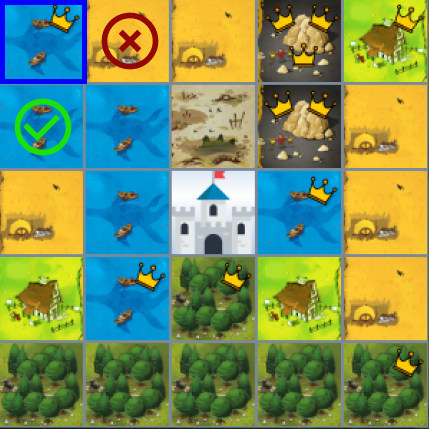
  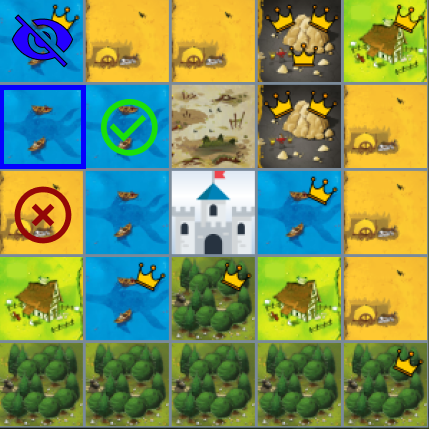
  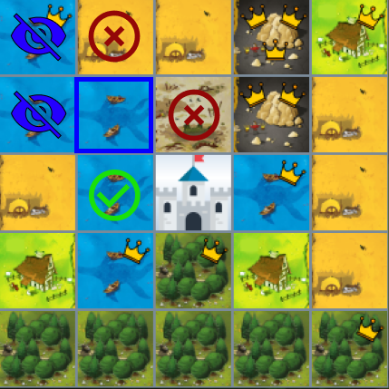
  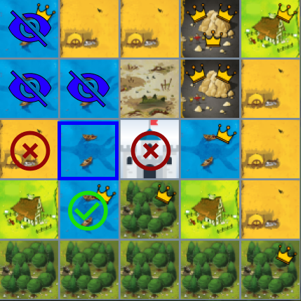
  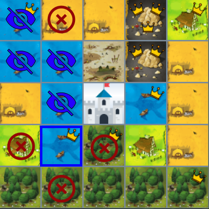
  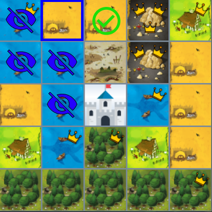

## Fin de partie
Nous considerons la fin de partie lorsque le deck du jeu est vide. Cependant pour ne pas bloquer une partie et comme l'indique les règles du jeu, il faut autorisé le joueur a défaussé sa tuile lorsqu'il n'a plus de possibilité de la jouer.

## Modes de jeu 

Les modes de jeu sont modélisés à l’aide du pattern Decorator. Nous avons opéré un changement de direction à ce sujet car, le pattern strategy ne correspondait pas exactement à nos besoin. En effet, cela nous empêchai de pouvoir seléctionner les deux modes de jeux en même temps.  
Le ModeDecorator possède un attribut privée wrapee de type GameMode qui est une interface. Les deux modes de jeux Harmony et MiddleKingdom, qui représentent les deux règle de calcul, hérite de cette classe.  
Cela permettra donc au joueur de choisir, sans problème, entre les modes :  
 
- Normal 
- Harmony 
- MiddleKingdom
- Harmony+MiddleKingdom
  

### A améliorer

Nous aurions aimé ne pas mettre les fonctions isHarmony() ,isMiddleKingdom() ou encore hasHarmony() dans les classes de mode de jeu, car si on ajoute plusieurs autres modes de jeux, chaques autres modes de jeux devraient ajouter des fonctions en plus.  

L’idéal pour obtenir l’information de quel mode de jeu nous avons, serait une liste de mode de jeux dans notre modèle, ainsi nos vues pourront y avoir accès (ce que nous avons besoin). Mais malheureusement nous n'avons pas eu le temps d’implémenter cela, même si nous prenons en compte la faiblesse de ce côté là.

### Point intéressant à noter

Nous avions pensé à utiliser le patron strategy, mais avant de l'implémenter nous avons vu que ce n'était pas la chose adaptée car nous pouvons additionner les modes de jeux, ainsi ajouter un nouveau mode de jeu, nous obligeait à créer autant de nouvelles classes qu’il y en avait ( si on ajoute un 3ème mode, cela nous ferait 4 nouvelles classes ! )

## Modèle MVC

Nous avons modélisé notre application en modèle MVC, c'est-à-dire un controller (GameController) qui va modifier le modèle lorsqu’un joueur va faire une action, une vue qui va transmettre au controller les demandes utilisateurs et afficher continuellement l’état du modèle. 

Les vues ordonnent la création des objets métiers au controller, qui lui, va ordonner à la classe maître (GameContext) la création des objets métiers. \
Le controller ne crée pas lui-même les objets métiers car il y aurait une trop forte dépendance entre le modèle et le controller.

Voici comment sont disposées les classes en appliquant le modèle MVC :

  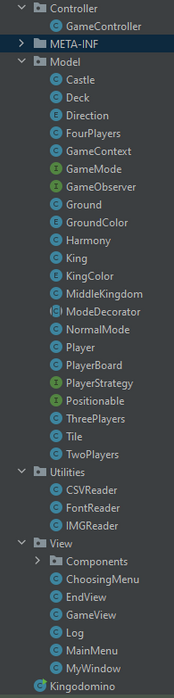

### Amélioration faite
Notre enum KingColor avait une fonction getColor() qui était censé nous envoyé une couleur pour l’afficher avec Swing (notre vue). Cependant nous avons compris que ca ne respectait pas l’architecture MVC, et que c'était de la responsabilité de la vue de trouver une couleur adapté pour ça vue (couleur visuels dans le cas du swing) par rapport à la constante de KINGCOLOR obtenue.

## Modèle maître

La classe GameContext est notre modèle maître et se chargera de récolter les informations utiles pour le déroulement d’une partie.  
De nouvelles méthodes ont été ajouté à cette classe:  
 
-skipturn(): cette méthode va permettre au joueur de sauter le tour seulement si le joueur ne peut pas placer la tuile sur son plateau.  
-rotateCurrentTile() et reverseCurrentTile() sont deux méthodes qui permettent respectivement de pivoter la tuile (4 types de direction) et d’inverser le côté gauche vers le côté droit de la tuile. 
 
Nous avons également des méthodes dans cette classe qui va permettre de choisir aléatoirement qui commence à choisir la tuile dès le début de la tuile mais aussi qui commencera au tour suivant en fonction du numéro de la tuile.  

Nous avons fait attention que cette classe ne soit pas un modèle dieu, en effet c’est le grand risque des grosses classes, mais ici gameContext ne fait seulement ce qu’il a vraiment besoin de faire et l’application est bien découpée. (GRASP)

## Contrôleur

Le contrôleur fait le lien entre le modèle et la vue, il récolte les demandes utilisateurs à partir de la vue, et les transmets en modifiant les modèles.
Le contrôleur connaît donc le modèle, et est connu par la vue.  
Il va donc permettre d’initialiser la partie grâce à la méthode initializeGame(), de pouvoir placer le château, de pouvoir choisir les tuiles et de les placer sur le plateau du joueur. 

## Vues

Les vues sont toutes créées à partir d’une vue principale nommée MyWindow, qui va créer différentes fenêtres :  
 
-MainMenu qui affiche le menu principal  
-ChoosingMenu qui affiche le menu permettant de choisir le nombre de joueur et le mode de jeu  
-GameView qui affiche la partie déroulante 
-EndView qui affiche la fin de la partie ainsi que le score de chaque joueur  
 
La classe Log va permettre de notifier le tour du joueur ainsi que sa couleur sur le terminal.  
 
Les vues ont été réfléchies à l’aide de Figma où différents prototypes sont réalisés afin de réaliser une jolie vue pour le jeu Kingdomino.  
 
Ci-dessous un extrait de nos prototypes 

  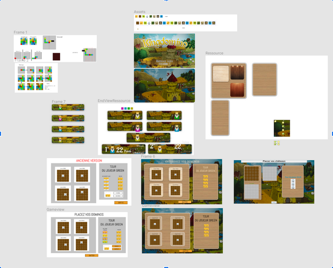

## Composants

Nous avons aussi essayé de diviser au maximum les composants qui était réutilisé tel que les plateaux des joueurs, les messages d’erreurs pour l’utilisateur ou les tuiles. Ainsi cela décharge les classes comme GameView qui faisait plus de travail qu’il n’en fallait.

## Utilities

Nous avons pris de nouvelles décisions concernant les utilitaires.
Nous avons créé une nouvelle classe FontReader qui utilise le pattern Singleton. Le patron de conception Singleton va s’assurer de gérer lui-même son instance et interdire aux autres classes de la construire. Cette classe permet aux utilisateurs d’avoir des styles de police spécifiques.   
De plus, IMGReader et CSVReader ont été mis en place au premier rendu. IMGReader permet d’afficher les images que ce soit pour le fond d’écran, les plateaux des joueurs mais aussi les tuiles. Quant au CSVReader, il va permettre de lire un fichier CSV contenant les numéros des tuiles ainsi que leur terrain et le nombre de couronnes qu'il contient.

## Stratégie par nombre de joueur

Concernant la stratégie par nombre de joueurs, rien a été modifié après la première version. 
Pour rappel, le nombre de tuiles, de plateaux et de roi changent en fonction du nombre de joueurs.

## Tests Unitaires

Nous avons réutilisé nos tests unitaires fait dans la partie 1, pour voir si nous avions pas rétrogradé en termes de fonctionnalités sans erreurs, mais nous avons aussi ajouté de nouveaux tests pour des fonctions comme le calcul de point en différent mode de jeu.

## Exécutable

Nous avons un exécutable au nom de KingDomino.jar qui se trouve dans le dossier out/artifacts/KingDomino_jar
L’exécutable affiche le jeu KingDomino qui peut etre joué. A la fin de chaque partie, le score du joueur est affiché. L’utilisateur peut décider de quitter le jeu en plein milieu de la partie, mais aussi rejouer à la fin de la partie. 

## Encapsulation

### Problème
Nous avions un problème d’encapsulation, en effet dans nos vues, la méthode utilisé pour récupérer était celle ci :

  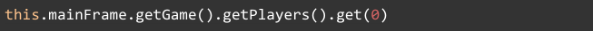

Et la fonction utilisé pour avoir les joueurs dans GameContext :

  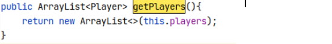

Cela nous faisait trop dépendre de l’implémentation des données choisies.

### Solution

Faire 2 fonctions différentes qui vont renvoyer respectivement le ième joueur et le nombre de joueurs dans la partie.

  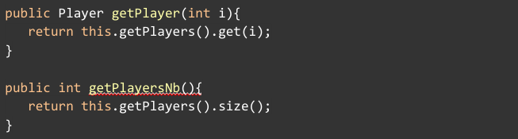

### Avantage
L’avantage de faire cela est que nous n’allons plus dépendre de l’implémentation que nous avons faite à propos des joueurs dans les vues. Que ce soit une Arraylist, une Map ou un Array[], la vue aura quoiqu’il arrive aucun souci grâce à ses méthodes dans GameContext (qui elle devront bien sûr être modifiées si l’on change la structure des données utilisées).

